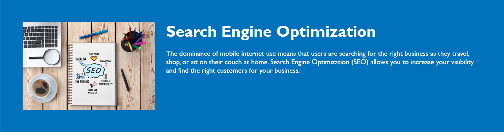

# module-one-challenge

## Description

This snippit of the code shows the structure of the website. Horiseon website offers services in Search engine optimization, Online reputation management, and Social media marketing.

***

## Table of Contents

Header,
Sections,
Hero Section,
Content Section,
Benefits Section,
Footer

## Content Section

Search Engine Optimization:

Includes an image related to search engine optimization.
Provides information about the importance of SEO in today's mobile-focused world.

Online Reputation Management:

Includes an image related to online reputation management.
Highlights the significance of managing online reputation due to the influence of opinions and social media.

Social Media Marketing:

Includes an image related to social media marketing.
Discusses the impact of social media on buying habits and the role of social media marketing.

## License

© 2023 Horiseon Social Solution Services, Inc.

